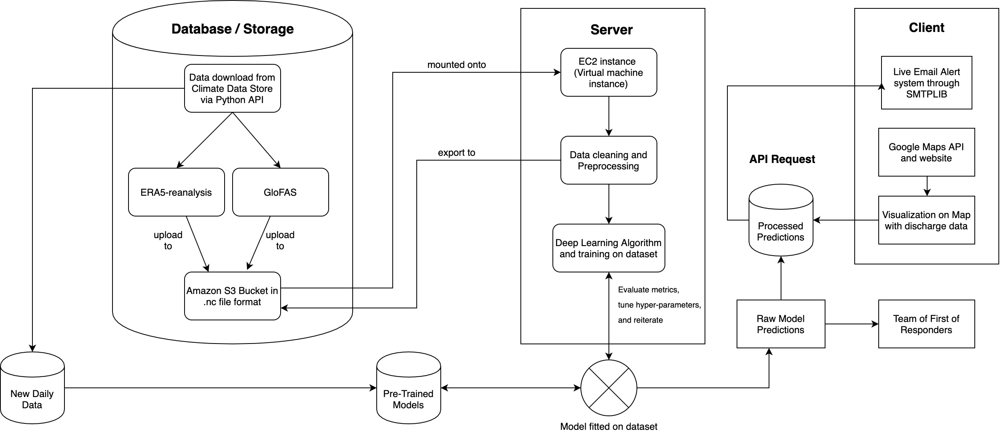
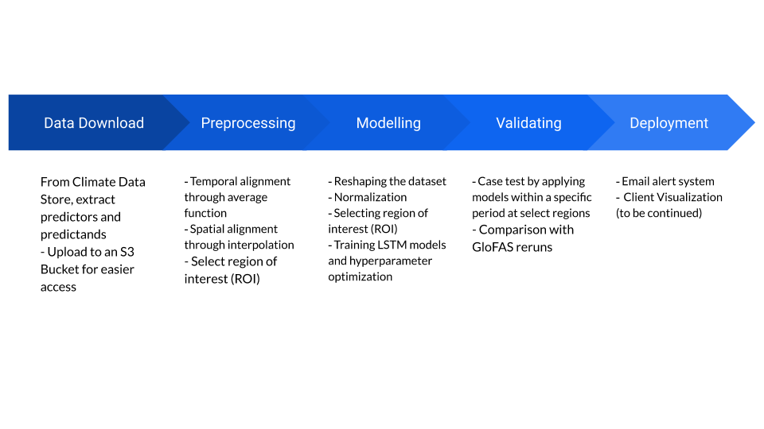

<h3 align="center">
  
</h3>

# A Novel Deep Learning Approach to Automated Global Flood Forecasting
A deep learning approach to flood forecasting has been explored in this project as a way to produce flood models that are scalable globally using  **RNN** (Recurrent Neural Net) **LSTM** (Long Short-Term Memory) implemented in Python 3.7/Keras.

The project has been deployed on a [website]('https://floodai.tech') equipped with flood mapping visualization and a live user alert system. [source](https://towardsdatascience.com/cartpole-introduction-to-reinforcement-learning-ed0eb5b58288)

Check out the full paper: [A Novel Deep Learning Approach to Automated Global Flood Forecasting](https://towardsdatascience.com/cartpole-introduction-to-reinforcement-learning-ed0eb5b58288)

## Project Origin
Fighting climate change is one of the top priorities in our century. After finding out that floods are the most common and wide-reaching type of climate disaster, and realizing that there was a deep lack of innovation in this domain, I decided to undertake this as a science fair project.

## Abstract
> Between 1995 and 2015, over 2.3 billion people have been affected by flooding events across the world (Wallamacq et al. 2015). To mitigate the effects of these types of natural catastrophes on the human population, scientists employ two different forecasting techniques: they build statistical systems that utilize the return period as the identification method of flash flood disasters, or create complex hydrological models that use a list of physical processes to model the behavior of a given river (Cloke and Pappenberger 2009). However, while each of these techniques have their advantages, they are also flawed. Firstly, while probabilistic models are fairly easy to set up, they are unable to incorporate exogenous variables into the equation. On the other hand, while hydrological models offer the ability to generate detailed flooding simulations, they require enormous amounts of measurements and careful tuning from hydrologists in order to offer an accurate riverine simulation. The implementation of a deep learning technique can bring the best of both worlds because of their ability to incorporate external variables for forecasting without the costly setup requirements that are necessary to simulate accurate flood maps. The project involves the use of cloud technologies to offer worldwide flood forecasts in the goal of providing many parts of the world with timely flooding information which can be visualized through a website. The design has demonstrated improvements to current ensemble prediction systems (EPS) made by the Global Flood Awareness System (GloFAS) 30-day forecasting models. This research provides new insight into the ways Deep learning and Big Data techniques can be used to provide the human population with modern flood forecasts and inundation models that are more automated and thus scalable. 

## Project Workflow

 
## Machine Learning Pipeline

## Datasets

## Data Processing

## Long Short-Term Memory (LSTM)
I experimented with the Long Short-Term Memory network (LSTM) variation of neural networks, a type of recurrent network (RNN) that is able to store information over long periods of time through dedicated memory cells but does not experience the exploding and/or vanishing gradient problems that traditional RNNs encounter, allowing them to thrive in learning long-term dependencies between input and output features and perform exceptionally well in extreme-weather event problems where the timescale is relatively long between the input and output result. They also have a demonstrated ability to model complex nonlinear feature interactions across numerous dimensions (Ogunmulu et al. 2016). All these properties become especially important in building more accurate modern forecasting models since floods are extremely complex events that are caused by a variety of factors which do not necessarily affect its water flow rate (i.e. discharge) linearly. 

### Hyperparameters:

    BATCH_SIZE = 32
	SEQUENCE_LENGTH = 50
	LEARNING_RATE = 0.01
	DECAY_RATE = 0.97
	HIDDEN_LAYER_SIZE = 256
	CELLS_SIZE = 2

### Model structure:

1. Dense layer - input: **4**, output: **24**, activation: **relu**
2. Dense layer - input **24**, output: **24**, activation: **relu**
3. Dense layer - input **24**, output: **2**, activation: **linear**

* **RMSE** loss function
* **Adam** optimizer

## Results

> CartPole-v0 defines "solving" as getting average reward of 195.0 over 100 consecutive trials. [source](https://gym.openai.com/envs/CartPole-v0/)
> 

##### Example trial chart

##### Solved trials chart

## Author

**Steven Gong**

[**LINKEDIN**](https://www.linkedin.com/in/gong-steven/)

[**GITHUB**](https://github.com/gongsta)

